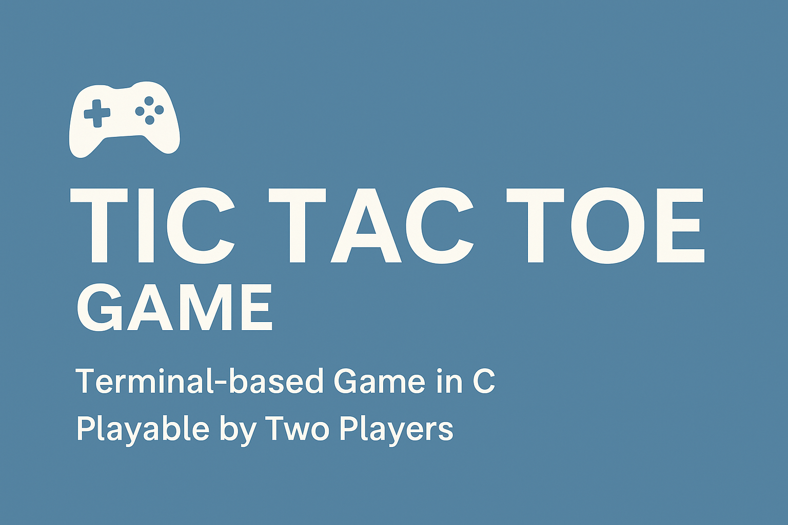

# 🎮 Tic Tac Toe Game in C

This is a simple terminal-based Tic Tac Toe game developed in C. It allows two players to play alternately, with real-time board updates after each move.

---

## 📌 Features
- Two-player mode
- Clean, user-friendly interface in terminal
- Win and draw detection
- Replay option after each game

---

## 🛠️ Tech Stack
- Language: C
- Tools: GCC Compiler, VS Code

---

## 🚀 How to Run

### Clone the Repository
```bash
git clone https://github.com/your-username/tic-tac-toe.git
